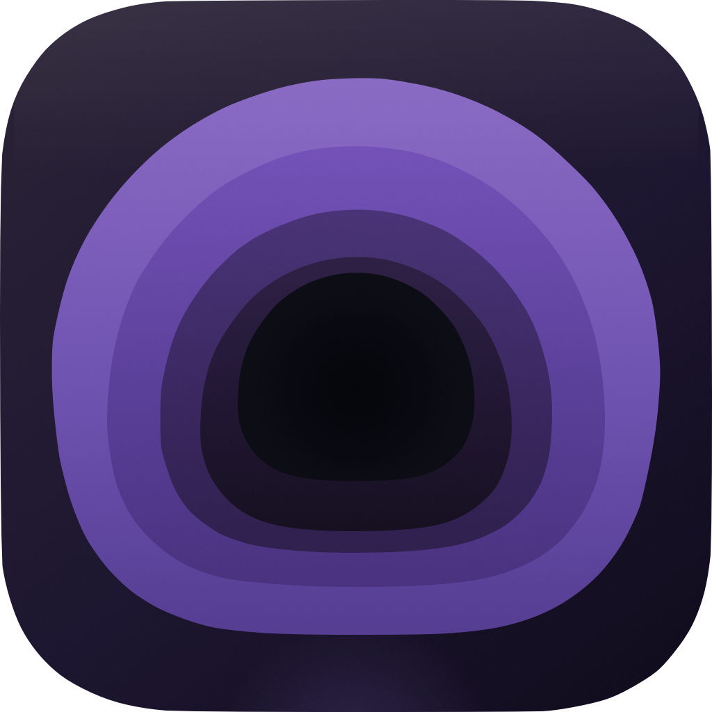

<p align="center">
  
</p>

<h1 align="center">Burrow</h1>

<p align="center">
  A lightweight, native macOS WireGuard VPN client for <a href="https://mullvad.net">Mullvad VPN</a>. Built with SwiftUI.
</p>


## Install

Download the latest DMG from [Releases](https://github.com/SuperManifolds/Burrow/releases), open it, and drag Burrow to your Applications folder.

## Requirements

- macOS 26.4 or later (Apple Silicon)
- A [Mullvad VPN](https://mullvad.net) account

## Building

```bash
git clone https://github.com/SuperManifolds/Burrow.git
cd Burrow
open Burrow.xcodeproj
```

Select your development team for both the **Burrow** and **BurrowTunnel** targets, then build and run.

The app requires Network Extension entitlements — you'll need to configure a provisioning profile with the `com.apple.developer.networking.networkextension` entitlement.

## Contributing

See [CONTRIBUTING.md](CONTRIBUTING.md) for guidelines.

## License

[MIT](LICENSE)
