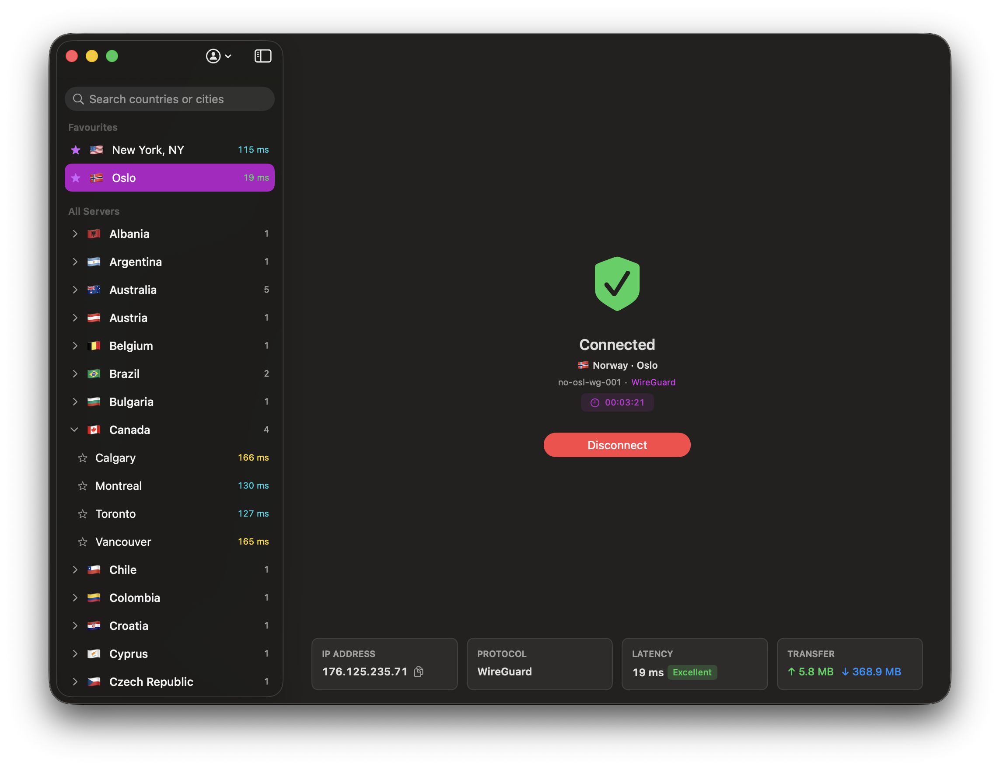

# Burrow

A lightweight, native macOS WireGuard VPN client for [Mullvad VPN](https://mullvad.net). Built with SwiftUI.



## Features

- **One-click connect** — Select a server, click connect. That's it.
- **Menu bar integration** — Lives in your menu bar with a status icon. No dock clutter.
- **Favourites** — Star your preferred servers for quick access.
- **Server browser** — Browse all Mullvad relay servers grouped by country, with live latency measurements.
- **Connection details** — See your IP address, protocol, latency, and transfer stats at a glance.
- **Switch servers** — Seamlessly switch between servers while connected.
- **Auto-connect** — Optionally connect to your last server on launch.
- **Launch at login** — Start Burrow automatically when you log in.
- **Configurable MTU** — Tune your tunnel's MTU for your network.
- **Device management** — View and remove registered devices from Settings.
- **Subscription status** — See your Mullvad subscription expiry in Settings.

## Requirements

- macOS 26.4 or later
- A [Mullvad VPN](https://mullvad.net) account

## Building

```bash
git clone https://github.com/SuperManifolds/Burrow.git
cd Burrow
open Burrow.xcodeproj
```

Select your development team for both the **Burrow** and **BurrowTunnel** targets, then build and run.

The app requires Network Extension entitlements — you'll need to configure a provisioning profile with the `com.apple.developer.networking.networkextension` entitlement.

## Contributing

See [CONTRIBUTING.md](CONTRIBUTING.md) for guidelines.

## License

[MIT](LICENSE)
